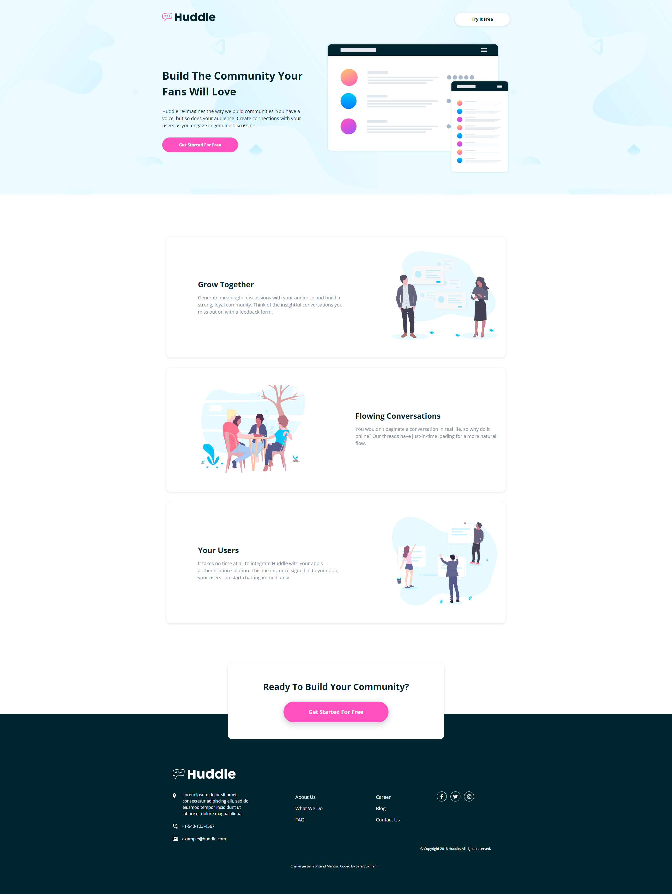

# Frontend Mentor - Huddle landing page with alternating feature blocks solution

This is a solution to the [Huddle landing page with alternating feature blocks challenge on Frontend Mentor](https://www.frontendmentor.io/challenges/huddle-landing-page-with-alternating-feature-blocks-5ca5f5981e82137ec91a5100). Frontend Mentor challenges help you improve your coding skills by building realistic projects. 

## Table of contents

- [Overview](#overview)
  - [The challenge](#the-challenge)
  - [Screenshot](#screenshot)
  - [Links](#links)
- [My process](#my-process)
  - [Built with](#built-with)
  - [What I learned](#what-i-learned)
  - [Continued development](#continued-development)
  - [Useful resources](#useful-resources)
- [Author](#author)
- [Acknowledgments](#acknowledgments)

**Note: Delete this note and update the table of contents based on what sections you keep.**

## Overview

### The challenge

Users should be able to:

- View the optimal layout for the site depending on their device's screen size
- See hover states for all interactive elements on the page

### Screenshot

### Links

- Solution URL: [https://github.com/Sammbra/Huddle-landing-page-with-alternating-feature-blocks](https://github.com/Sammbra/Huddle-landing-page-with-alternating-feature-blocks)
- Live Site URL: [https://adoring-mayer-d663ef.netlify.app/](https://adoring-mayer-d663ef.netlify.app/)

## My process

### Built with

- Semantic HTML5 markup
- CSS custom properties
- Flexbox
- CSS Grid
- Desktop-first workflow
- BEM

### What I learned

I learned how to write BEM, and how to color svg images.

### Continued development

I would work a bit more on footer, to make it better.

### Useful resources

- [Box shadow](https://getcssscan.com/css-box-shadow-examples) - This website has nice box-shadow examples.
- [Fontawesome](https://fontawesome.com/) - My favorite icons website.
- [Circular background for icons](https://markheath.net/post/font-awesome-circle-background) - This site was useful for me to learn how to make a perfect circle around an icon or an image.
- [BEM](https://sparkbox.com/foundry/bem_by_example) - Useful site to understanding and writing better BEM.

## Author

- Frontend Mentor - [@Sammbra](https://www.frontendmentor.io/profile/Sammbra)

